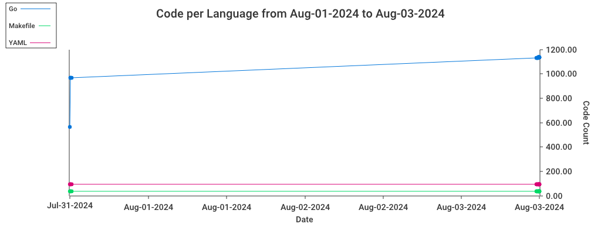

# Code Stats

Collects the code statistics of a given directory, and could compare with the previous stats.
  
## Usage

- Collect the code stats of the current directory and store it in `.stats` directory.
  ```shell
  code-stats
  ```
  
- Compare the previous code stats of the current directory stored in `.stats` directory and draw a chart for `go` and `java` languages.
  ```shell
  code-stats --draw-chart --languages go,java --only-compare-input
  ```
  
### Flags

```text
   --verbose                                                    enable verbose output. (default: false)
   --no-emoji                                                   disable emojis in the output. (default: false)
   --no-color                                                   disable color output. (default: false)
   --omit-dir value [ --omit-dir value ]                        directories to omit from the stats collection. (default: ".idea", "vendor", ".stats")
   --input value [ --input value ]                              list path to the input files or directories (default: ".stats")
   --only-compare-input, -c                                     only compare the input files, do not calculate the current stats (default: false)
   --draw-chart, -d                                             draw chart (default: false)
   --languages value, -l value [ --languages value, -l value ]  languages to include in the chart, require at least one if --draw-chart is set (default: "go")
   --stat-name value, -n value                                  name of the stat, accepted values: bytes, code_bytes, lines, code, comment, blank, complexity, count, weighted_complexity (default: "code")
   --help, -h                                                   show help
   --version, -v                                                print the version
```

### Chart output




