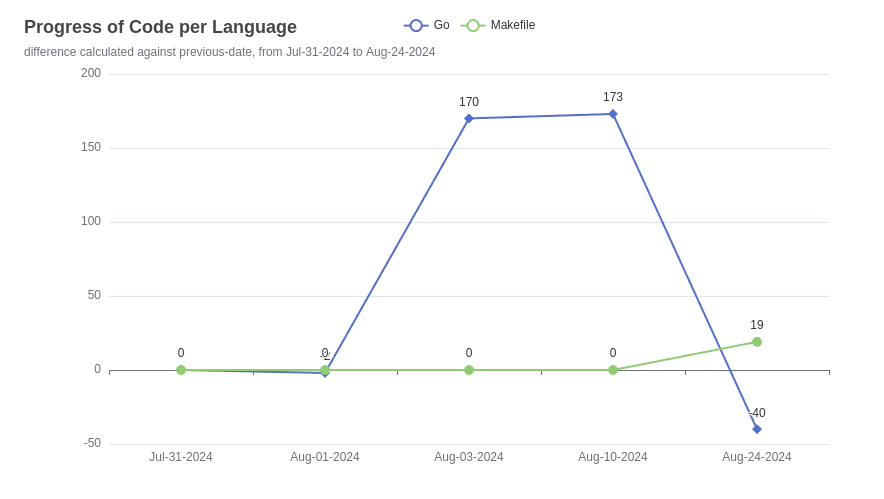
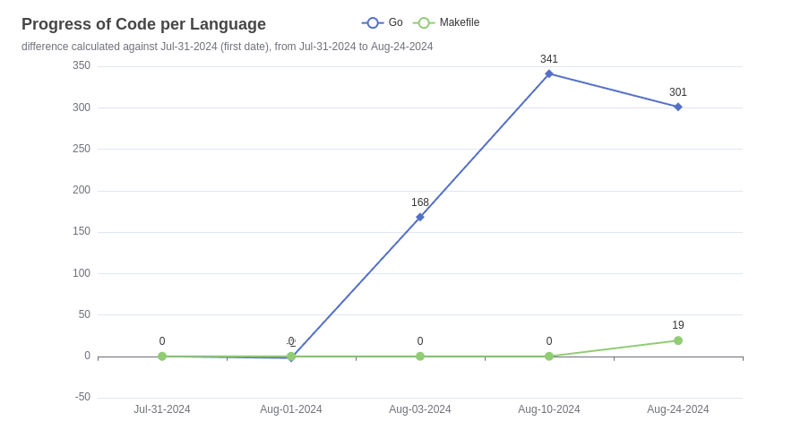

# Code Stats

Code Stats is a tool that leverages SCC to gather code statistics from a specified directory, allowing you to compare these stats over time and visualize your progress with charts.

- Use the `--diff` flag to compare the current stats with those from the previous day, the first day, or a specific date.
- The `--diff-pivot` flag allows you to specify the date to compare the stats with. By default, this is set to the 'previous-day' (the last day with recorded data, not necessarily yesterday).
  - You can also use the value `first-date` to compare with the first recorded date in the dataset.
  - Dates should be provided in the format 'YYYY-MM-DD'.


## Features

- **Code Statistics:** Automatically gathers and saves detailed code statistics.
- **Progress Visualization:** Generates charts to track codebase changes over time visually.
- **Customizable:** Supports multiple programming languages and customizable settings for tailored insights.

## How it works?

First, data is collected using [SCC](https://github.com/boyter/scc) and dumped into a JSON file, with the timestamp as the key. When the user requests a chart, the tool retrieves this data from the specified source directory (default: `.stats/`). It then generates a time series for each selected language based on the statistics and renders a linear chart in HTML format.

## Getting Started

### Installation

- **Download the latest release:**
   Download the latest release from the [releases page](https://github.com/Tecnologer/code-stats/releases)
- **Install using Go:**
   Run the following command to install the latest version of Code Stats:
    ```shell
     go install github.com/tecnologer/code-stats@latest
    ```
- **Clone, build, and install:**
  
    Clone the repository, build the project, and install the binary:

  ```shell
  # Clone the repository
  git clone https://github.com/Tecnologer/code-stats.git
  # Change the directory
  cd code-stats
  # Build and install the project
  make
  ```

## Usage

1. **Collecting Statistics:** Run `code-stats` to collect the statistics for today. Repeat this step on subsequent days to collect more data.
   ```shell
   code-stats
   ```

2. **Visualizing Progress:** Once you have enough data, draw the chart using the following command:
    ```shell
    code-stats --draw-chart --languages go,java --only-compare-input
    ```
    To see the difference between the current day and the previous day, add the `--diff` flag:
     ```shell
    code-stats --draw-chart --languages go,java --only-compare-input --diff
    ```
3. **Display Help:**: If you want to see more info, use the `--help`.
   ```shell
   code-stats --help
   ```
     
### Command Line Flags

```text
   --verbose                                                    enable verbose output. (default: false)
   --no-emoji                                                   disable emojis in the output. (default: false)
   --no-color                                                   disable color output. (default: false)
   --omit-dir value [ --omit-dir value ]                        directories to omit from the stats collection. (default: ".idea", "vendor", ".stats")
   --input value, -i value [ --input value, -i value ]          list path to the input files or directories (default: ".stats")
   --only-compare-input, -c                                     only compare the input files, do not calculate the current stats (default: false)
   --draw-chart, -d                                             draw chart (default: false)
   --languages value, -l value [ --languages value, -l value ]  languages to include in the chart, require at least one if --draw-chart is set (default: "go")
   --stat-name value, -s value                                  name of the stat, accepted values: bytes, code_bytes, lines, code, comment, blank, complexity, count_files, weighted_complexity (default: "code")
   --diff, --df                                                 instead of displaying the stats, it calculates the difference between the current and the previous one. (default: false)
   --diff-pivot value, --dp value                               date to calculate the difference from, it could be 'previous-day', 'first-date', or a date in the format 'YYYY-MM-DD' (the date should exists in the data). (default: previous-day)
   --output-chart value, -o value                               path to save the chart (default: YYYY-MM-DD_stats.html)
   --help, -h                                                   show help
   --version, -v                                                print the version
```

### Chart output

Below is a screenshot of the [example.html](./examples/example.html) chart showing the development progress of a project in Go and Makefile:
```shell
code-stats  --draw-chart  --only-compare-input --languages go,makefile
```


It supports now calculates the difference between the current and the previous stats ([example-diff.html](./examples/example-diff.html)), and it can draw a chart to visualize the progress.
```shell
code-stats  --draw-chart --only-compare-input --languages go,makefile --diff
```



It also supports the `--diff-pivot` flag to compare the stats with a specific date, for example, the first recorded date in the dataset ([example-diff-pivot.html](./examples/example-diff-pivot.html)).
```shell
code-stats  --draw-chart --only-compare-input --languages go,makefile --diff --diff-pivot first-date
```



### TODO

- [ ] Support more languages as plugins, first Spanish and English.
- [ ] Support different output chart formats (png, pdf, etc).
