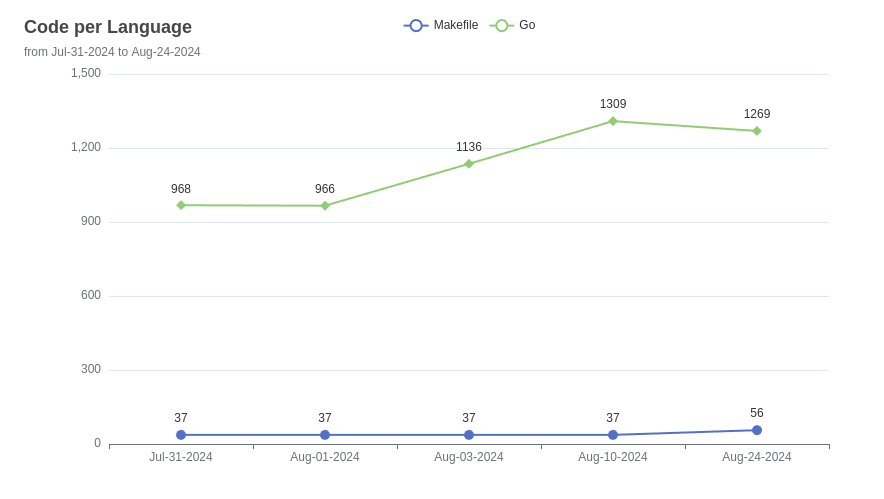

# Code Stats

**Code Stats** is a command-line tool designed to track and visualize the development progress of coding projects. It collects statistics on code in a specified directory and displays changes over time through generated charts.

## Features

- **Code Statistics:** Automatically gathers and saves detailed code statistics.
- **Progress Visualization:** Generates charts to visually track codebase changes over time.
- **Customizable:** Supports multiple programming languages and customizable settings for tailored insights.

## Getting Started

### Installation

- **Download the latest release:**
   Download the latest release from the [releases page](https://github.com/Tecnologer/code-stats/releases)
- **Install using Go:**
   Run the following command to install the latest version of Code Stats:
    ```shell
     go install github.com/tecnologer/code-stats@latest
    ```
- **Clone, build, and install:**
  
    Clone the repository, build the project, and install the binary:

  ```shell
  # Clone the repository
  git clone https://github.com/Tecnologer/code-stats.git
  # Change the directory
  cd code-stats
  # Build and install the project
  make
  ```

## Usage

1. **Display Help:**
   Run the following command to display the help message:
   ```shell
   code-stats --help
   ```
   
2. **Collecting Statistics:**
   Run the following command to collect and store statistics in the .stats directory:
   ```shell
   code-stats
   ```

3. **Visualizing Progress:**  
    
    To compare past statistics and visualize the development progress in a chart:  
    ```shell
    code-stats --draw-chart --languages go,java --only-compare-input
    ```
  
### Command Line Flags

```text
   --verbose                                                    enable verbose output. (default: false)
   --no-emoji                                                   disable emojis in the output. (default: false)
   --no-color                                                   disable color output. (default: false)
   --omit-dir value, -o value [ --omit-dir value, -o value ]    directories to omit from the stats collection. (default: ".idea", "vendor", ".stats")
   --input value, -i value [ --input value, -i value ]          list path to the input files or directories (default: ".stats")
   --only-compare-input, -c                                     only compare the input files, do not calculate the current stats (default: false)
   --draw-chart, -d                                             draw chart (default: false)
   --languages value, -l value [ --languages value, -l value ]  languages to include in the chart, require at least one if --draw-chart is set (default: "go")
   --stat-name value, -s value                                  name of the stat, accepted values: bytes, code_bytes, lines, code, comment, blank, complexity, count_files, weighted_complexity (default: "code")
   --diff, --df                                                 instead of displaying th stats, it calculates the difference between the current and the previous one. (default: false)
   --help, -h                                                   show help
   --version, -v                                                print the version
```

### Chart output

Below is a screenshot of the [example.html](./examples/example.html) chart showing the development progress of a project in Go and Makefile:
```shell
code-stats  --draw-chart  --only-compare-input --languages go,makefile
```



It supports now calculates the difference between the current and the previous stats ([example-diff.html](./examples/example-diff.html)), and it can draw a chart to visualize the progress.
```shell
code-stats  --draw-chart --only-compare-input --languages go,makefile --diff
```


